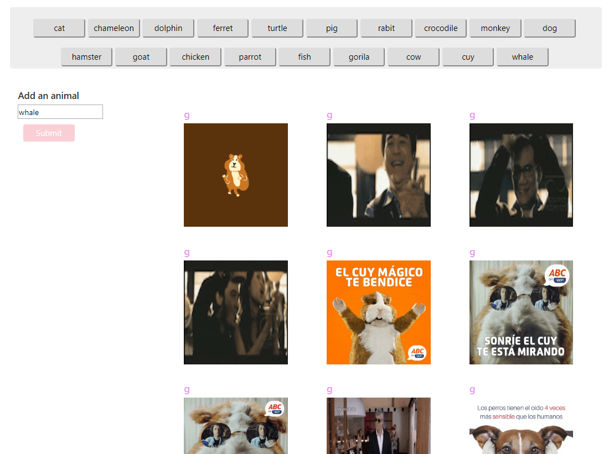

# University of Central Florida
### Coding Bootcamp 
#### Full Stack Developer 

- - -

### GIPHY API

#### Overview

On this code, we were challenged to use APIs and call certain information defined by parameters,
This web application will allow the user to get some gifs and certain details of itself with it.
The user also may be able to add some new buttons with the animal, which is going to define the search with every click.

If you click a different button (animal), the gifs section will remove the previous search and it will show the new information. 

##### What Language?

*  Libraries and language used for accomplished this assignment 

    * HTML
    * CSS
    * Javascript
    * Jquery
    * API
    * GIPHY

To learn more about GIPHY, click [here!](https://giphy.com/)

## [Click here to see the demo](https://marciagzq.github.io/GIPHY/)

*If any suggestion, do not hesitate to contact me on my personal email: marcia.gzq@gmail.com
I would appreciate any comment, I know it may be very beneficial on my professional growth.*

